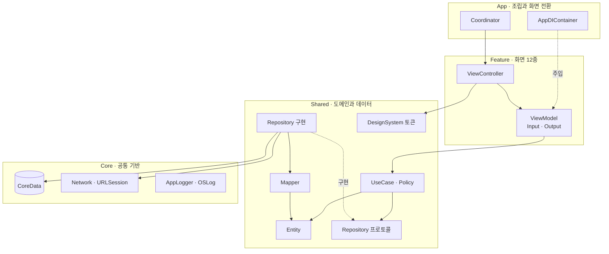
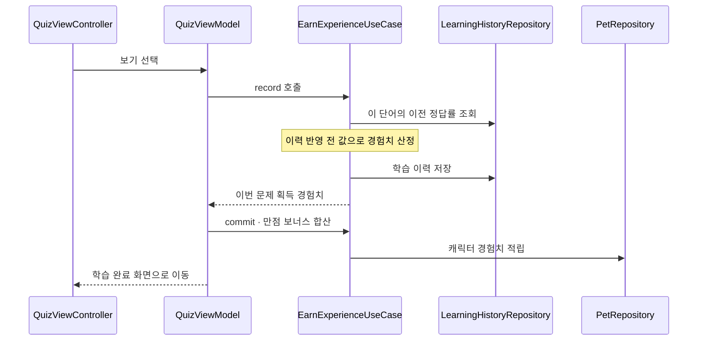
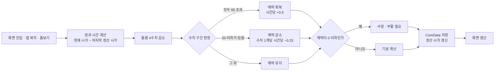

<div align="left">

# 단어고치

단어고치는 영어학습을 하고 사용자의 성장을 캐릭터의 성장으로 표현해<br/>
학습의 재미와 성장을 직관적으로 보여주는 앱 입니다

[](https://apps.apple.com/kr/app/%EB%8B%A8%EC%96%B4%EA%B3%A0%EC%B9%98/id6753820016)

</div>

---

- **핵심 개발**: 2025.09–2025.10
- **유지보수**: 2025.10–현재
- **개발 인원**: 1인 개발
- **최소 지원 버전**: iOS 16.0

---

## 스크린샷

### 온보딩

| 관심사 선택 | 배경 테마 선택 | 알 선택 |
|:---:|:---:|:---:|
|  |  |  |

### 학습

| 단어 탐색 | 4지선다 퀴즈 | 학습 결과 |
|:---:|:---:|:---:|
|  |  |  |

### 단어장

| 추천 단어장 | 단어 추가 | 단어장 상세 |
|:---:|:---:|:---:|
|  |  |  |

### 캐릭터

<table>
  <thead>
    <tr>
      <th align="center">캐릭터 화면</th>
    </tr>
  </thead>
  <tbody>
    <tr>
      <td align="center">
        
      </td>
    </tr>
  </tbody>
</table>

---
## 핵심 기능

### 1. 테마 설정
* Unsplash 사진 검색으로 배경 테마 설정

### 2. 단어장

* Core Data 기반 커스텀 단어 CRUD
* 추천 단어장의 단어를 `sourceWordId`로 Core Data에 저장
  — 원본을 복사해 나의 단어장에 넣고, 복사본에 원본 id를 남겨 원본–사본을 연결
* 학습중 단어장 전환 (앱 전체에 항상 1개)

### 3. 단어 탐색

* 쇼츠·릴스 형태의 세로 무한 스크롤
* Core Data 기반 단어별 학습 히스토리를 조회해 학습 횟수와 정답률 표시
*  SwiftUI로 포팅한 단어 카드 UI
* TTS 발음 재생

### 4. 4지선다 퀴즈

* P2C(Power of Two Choices) 알고리즘으로 학습중 단어장에서 출제 단어 선정
* 전수 정렬 없이 O(n) 선정, 매번 다른 문제 구성 유지
* 진행률 표시 및 정답/오답 즉시 피드백

### 5. 학습 결과

* 정답/오답 수와 획득 경험치 요약
* 전 문제 정답 시 보너스 경험치
* 틀린 문제만 다시 풀기 / 이어서 학습하기

### 6. 캐릭터 육성

* 포만감, 갈증, 즐거움, 청결 4수치 돌보기 기능
* 돌봄 수치 기반 기분 9종 표시
* 체력(HP) 관리, 사망 및 부활
* 학습 경험치로 수동 레벨업 (최고 Lv.7)
* 앱 종료 중 흐른 시간을 재실행 시 일괄 정산
* 스프라이트 시트 기반 픽셀 아트 애니메이션

---

## 아키텍처

### Clean Architecture + MVVM-C



### 디렉토리

```
Danogotchi/
├── App/           앱 진입점 · AppDIContainer · Coordinator 계층
├── Core/          BaseViewController · CoreDataStack · 네트워크 · AppLogger
├── Shared/
│   ├── Domain/    Entity · Repository 프로토콜 · UseCase · Policy
│   ├── Data/      Repository 구현 7종 · Mapper · CoreData 모델 · 추천 단어 시드
│   └── DesignSystem/  색 · 폰트 · 여백 토큰과 공통 컴포넌트
└── Feature/       Feature 폴더 11개 (View / ViewModel / Components / Coordinator)
```

## 핵심 아키텍처 패턴

### Clean Architecture
  - App / Core / Shared / Feature 4계층 분리, 의존 방향은 `Feature → Shared → Core` 단방향이며 Feature 간 화면 연결은 Coordinator에서 수행

### MVVM-C (Input/Output)
- 모든 ViewModel이 `BaseViewModel` 프로토콜의 `transform(input:) -> Output`을 구현해 입력과 출력을 한 함수에 고정

### RxSwift 단방향 바인딩
- Input은 `Observable`, Output은 `Driver`/`Signal`로 노출해 UI 스레드와 에러 처리를 타입으로 강제

### Coordinator 패턴 
- 모든 화면 전환을 `Coordinator`가 담당(`AppFlowCoordinator` → `MainCoordinator` / `OnboardingCoordinator` → Feature별 Coordinator), VC 직접 push 금지, VC ↔ Coordinator는 delegate로 통신

### UseCase 레이어
- 비즈니스 규칙을 `AddVocabUseCase`, `StartQuizUseCase`, `CarePetUseCase`, `EarnExperienceUseCase` 등으로 분리하고, 정책은 `PetStatePolicy` · `PetLevelPolicy` · `ExperiencePolicy`에 상수까지 모아 테스트 가능하게 유지
- Repository 접근이 필요한 ViewModel은 UseCase 프로토콜을 경유하며, UI 상태 로직과 상태 없는 Domain Policy에는 형식적인 UseCase를 만들지 않음

### Repository 패턴 + DIP
- `Shared/Domain/Interfaces`의 프로토콜과 `Shared/Data/Repositories`의 구현을 분리해 Domain이 CoreData·네트워크를 모르게 구성

### 의존성 주입
- `AppDIContainer`가 팩토리 메서드로 UseCase·ViewModel을 조립하고 조립은 App 계층에서만 수행. 단일 인스턴스가 필요한 Repository(활성 단어장 신호, 펫 1마리 불변식)는 컨테이너가 `lazy`로 보유

### Router 패턴 
- `UnsplashApiRouter` · `WeatherApiRouter`가 `Endpoint`를 구현하고, `DefaultApiClient`가 URLSession과 async/await로 요청을 실행

### 디자인 시스템 토큰화
- `AppColor` · `AppFont` · `AppSpacing` · `AppRadius` 토큰과 공용 컴포넌트를 `Shared/DesignSystem`에 모아 UIKit·SwiftUI 양쪽에서 공유

### 데이터 플로우 
- View → ViewModel → UseCase → Repository → CoreData 동기 저장 성공 → 변경 신호(Relay) 방출 → 구독 측 재조회. 저장 실패는 롤백 후 화면에 전달하며, 성공한 작업만 UI 갱신과 화면 전환으로 연결

### 테스트: 
- 정책·UseCase·ViewModel·영속화·네트워크 테스트 153개 (`PetStatePolicyTests`, `VocabUseCaseTests`, `PetPersistenceTests` 등)

---

## 데이터 흐름

### 퀴즈 정답 → 경험치 적립



### 캐릭터 상태 정산

화면을 열거나 앱으로 돌아온 순간, 마지막 정산 시각과의 차이를 계산해 한 번에 반영후 저장



---

## 주요 기술

### RxSwift / RxCocoa
* ViewModel은 `Input` / `Output` 구조체와 `transform(input:)` 단일 진입점을 갖습니다.
* 외부에는 `Driver` · `Signal`로 노출해 메인 스레드 실행을 보장합니다.

### Coordinator
* `AppFlowCoordinator` → `MainCoordinator` / `OnboardingCoordinator` → 화면별 Coordinator 계층입니다.
* 온보딩 완료 여부에 따른 첫 화면 분기도 여기서 결정합니다.

### CoreData
* 엔티티 4종(`VocabEntity` · `VocabBookEntity` · `LearningHistoryEntity` · `PetEntity`)을 사용합니다.
* `Mapper`의 `toDomain()`과 필요한 모델의 `apply(_:)`가 엔티티와 도메인 모델을 변환해 도메인 코드가 `NSManagedObject`를 모릅니다.
* 네트워크 DTO는 `toEntity()`로 Domain Model에 변환하며, 읽기 전용 흐름에 사용하지 않는 `toDTO()`는 만들지 않습니다.

### 배경 테마 이미지
* 선택한 사진은 URL만 저장하지 않고 `Library/Application Support/ThemeImage/`에 실제 파일로 내려받아 보관합니다. URL이 내려가거나 오프라인이어도 배경이 유지됩니다.
* Unsplash 이미지 CDN에 `fit=crop`으로 화면 픽셀 크기를 요청해 업스케일 없이 받고, HEIC로 저장합니다(실패 시 WebP로 대체).
* 표시할 때는 `ImageDecoder`가 ImageIO로 백그라운드에서 디코딩까지 끝내 첫 렌더링이 끊기지 않게 합니다.

### DiffableDataSource
* 단어 카드·단어장·테마 목록에 사용합니다.
* 테마 검색 화면은 높이가 제각각인 사진을 위해 워터폴 레이아웃(`WaterFallLayout`)을 직접 구현했습니다.

### SwiftUI 부분 도입
* 단어 카드의 블러 레이어만 SwiftUI로 구현.
* `UIHostingController`로 UIKit에 SwiftUI 포팅.

### 디자인 시스템
* 색·폰트·여백·모서리 반경을 토큰(`AppColor` · `AppFont` · `AppSpacing` · `AppRadius` · `AppBorder`)으로 고정했습니다.
* 화면 코드에 색상값과 폰트 크기를 직접 쓰지 않습니다.

### OSLog
* `AppLogger` 5개 카테고리로 분류합니다.
* subsystem이 번들 ID라 개발용과 운영용 로그가 Console에서 자동으로 분리됩니다.

### XCTest
* 정책·UseCase·ViewModel·영속화·네트워크 테스트 **153개**를 운영합니다.

### 빌드 설정
* `xcconfig`로 개발용·운영용 스킴을 분리했습니다.
* 번들 ID, 앱 이름, 스킴에 따라 자동으로 바뀝니다.

---

## 테스트

정책·UseCase·ViewModel·영속화·네트워크 테스트 **153개**를 운영합니다.

| 파일 | 검증 내용 |
|---|---|
| `PetStatePolicyTests` (34) | 시간 경과, 돌보기, 체력 구간, 사망·부활 |
| `PetPersistenceTests` (22) | 펫 UseCase·Repository 동작, 경험치 적립 실패 전달 |
| `PetLevelPolicyTests` (7) · `PetHeartPolicyTests` (7) · `PetNamePolicyTests` (7) | 레벨·하트 표시·이름 정책 |
| `PetSpriteTests` (13) · `PetTypeTests` (2) · `WeatherSpriteTests` (8) | 스프라이트 리소스·격자·애니메이션 구성 |
| `VocabUseCaseTests` (3) · `StudyReminderPolicyTests` (4) | 단어 조회 조립·변경 신호·알림 일정 |
| `SearchThemeViewModelTests` (6) | 검색 응답 순서·요청 취소·페이지 재시도 |
| `PersistenceFailureTests` (8) | 저장 실패 롤백, 생성·삭제·활성 전환·이력·경험치·시드 재시도 |
| `PersistenceViewModelTests` (5) | 실패 시 폼·목록 유지, 완료 이벤트 차단, 다음 입력으로 복구 |
| `SQLitePersistenceTests` (2) | SQLite 저장소 재개방 후 데이터·삭제 결과 확인 |
| `QuizUseCaseTests` (5) · `QuizViewModelTests` (5) | 출제 경계·채점·경험치·실패한 저장만 재시도 |
| `ApiClientTests` (6) | URLSession 요청 구성·JSON·HTTP 오류·원시 바이트 |
| `ThemeImagePersistenceTests` (6) | 이미지 교체, 포맷 요청 대체, 실패 시 기존 파일 보존 |
| `WeatherUseCaseTests` (3) | 좌표 전달·위치 조회 실패·날씨 요청 실패 |
