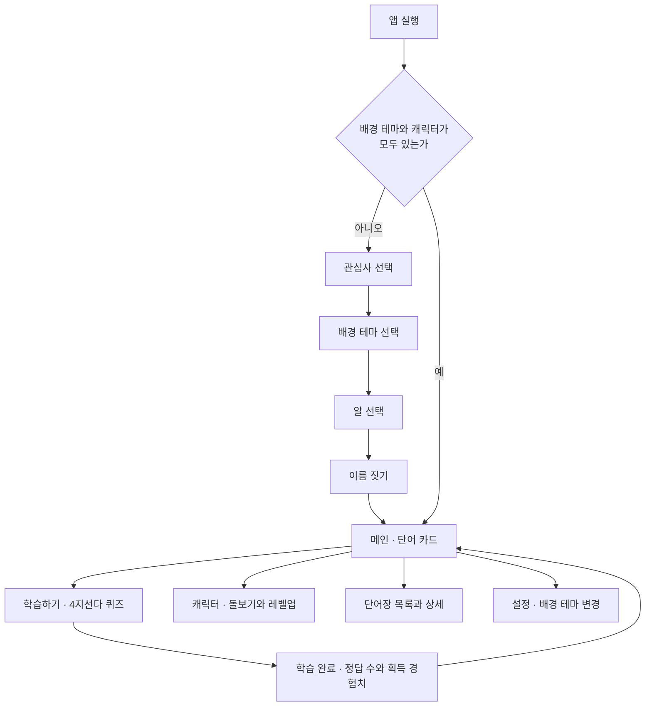
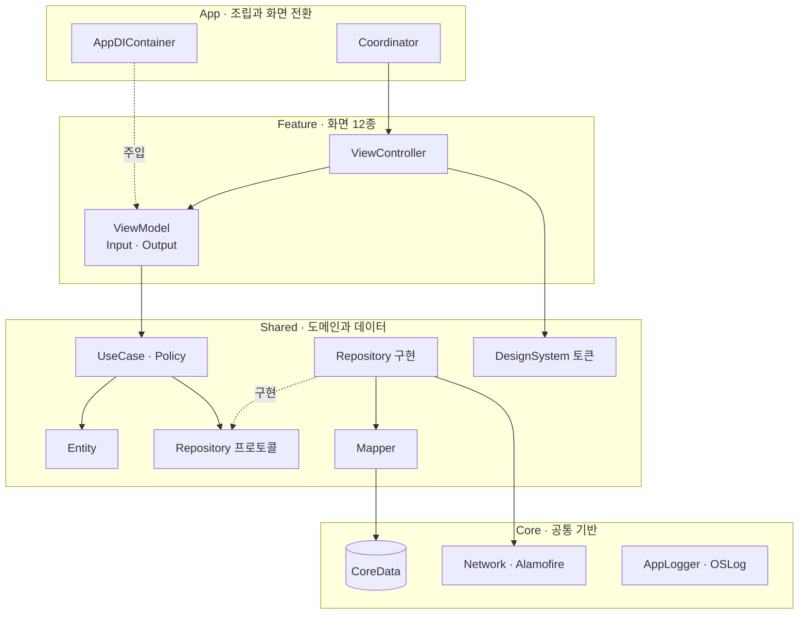
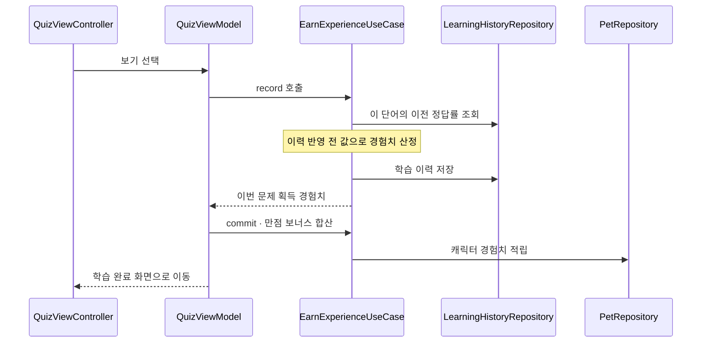
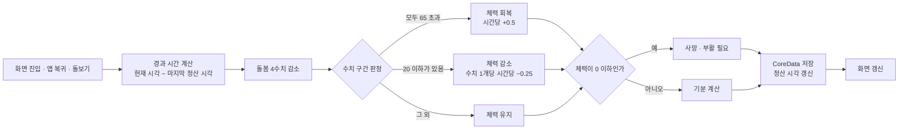

<div align="left">

# 단어고치 (Danogotchi)

단어고치는 영어학습을 하고 사용자의 성장을 캐릭터의 성장으로 표현해<br/>
학습의 재미와 성장을 직관적으로 보여주는 앱 입니다

[](https://apps.apple.com/kr/app/%EB%8B%A8%EC%96%B4%EA%B3%A0%EC%B9%98/id6753820016)

</div>

---

- **핵심 개발**: 2025.09–2025.10
- **유지보수**: 2025.10–현재
- **개발 인원**: 1인 개발
- **담당 범위**: 기획, 디자인, iOS 개발, 테스트, 출시 및 유지보수
- **최소 지원 버전**: iOS 16.0

---

## 스크린샷

### 온보딩

| 관심사 선택 | 배경 테마 선택 | 알 선택 |
|:---:|:---:|:---:|
|  |  |  |

### 학습

| 단어 탐색 | 4지선다 퀴즈 | 학습 결과 |
|:---:|:---:|:---:|
|  |  |  |

### 단어장

| 추천 단어장 | 단어 추가 | 단어장 상세 |
|:---:|:---:|:---:|
|  |  |  |

### 캐릭터

<table>
  <thead>
    <tr>
      <th align="center">캐릭터 화면</th>
    </tr>
  </thead>
  <tbody>
    <tr>
      <td align="center">
        
      </td>
    </tr>
  </tbody>
</table>

---

## 핵심 기능
**단어 학습**
- 추천 단어장에서 마음에 드는 단어는 "나의 단어장"에 담고, 직접 추가·수정·삭제할 수 있습니다.

**4지선다 퀴즈**
- 학습중인 단어장에서 최대 20문제를 출제합니다. 단어를 무작위로 고르지 않고 **아직 덜 학습한 단어를 우선 선정**합니다.

**캐릭터 육성**
- 퀴즈 정답으로 경험치를 모아 직접 레벨업합니다(최고 Lv.7). 돌봄 4수치와 체력(HP), 사망·부활이 있습니다.

**시간 경과 반영**
- 앱을 꺼둔 동안 흘러간 시간을 **다시 열 때 한 번에 계산**합니다. 백그라운드 작업이나 상시 타이머를 쓰지 않습니다.

**배경 테마**
- Unsplash에서 사진을 검색해 메인 화면 배경으로 지정합니다.

**탐색화면**
- 단어 발음 듣기 버튼을 이용해 단어의 발음 듣기 기능
- 단어별 정답률 표시

---

## 화면 흐름



온보딩 도중 앱이 종료돼도 **이미 끝낸 단계는 다시 묻지 않습니다.** 테마만 저장된 상태로 재실행하면 알 선택부터 이어서 진행합니다.

---

## 아키텍처

Clean Architecture + MVVM-C 구조입니다. 화면(Feature)은 서로를 참조하지 않고, 구현체를 조립하는 위치는 `AppDIContainer` 한 곳뿐입니다.



- **의존 방향은 `Feature → Shared → Core` 한 방향입니다.** 반대 방향 참조와 Feature 간 참조가 없습니다.
- **도메인은 저장 방식을 모릅니다.** UseCase는 `Repository` 프로토콜에만 의존하고, CoreData·네트워크를 아는 구현체는 `AppDIContainer`에서 주입합니다. 저장소를 바꿔도 도메인 코드는 그대로입니다.
- **화면 전환은 ViewController가 직접 하지 않습니다.** delegate로 Coordinator에 위임하고, 자식 Coordinator의 생명주기는 `addChild` / `removeChild`로 관리합니다.

### 디렉토리

```
Danogotchi/
├── App/           앱 진입점 · AppDIContainer · Coordinator 계층
├── Core/          BaseViewController · CoreDataStack · 네트워크 · AppLogger
├── Shared/
│   ├── Domain/    Entity · Repository 프로토콜 · UseCase 16개 · Policy 4개
│   ├── Data/      Repository 구현 5종 · Mapper · CoreData 모델 · 추천 단어 시드
│   └── DesignSystem/  색 · 폰트 · 여백 토큰과 공통 컴포넌트
└── Feature/       화면 단위 폴더 12개 (View / ViewModel / Components / Coordinator)
```

---

## 데이터 흐름

### 퀴즈 정답 → 경험치 적립

경험치는 **학습 이력을 저장하기 전의 정답률**로 계산합니다. 순서를 바꾸면 방금 맞힌 정답이 스스로 정답률을 올려 보상을 깎습니다.



### 캐릭터 상태 정산

타이머를 돌리지 않습니다. **화면을 열거나 앱으로 돌아온 순간**, 마지막 정산 시각과의 차이를 계산해 한 번에 반영하고 저장합니다.



---

## 주요 기술

| 기술 | 사용 내용 |
|---|---|
| **UIKit + SnapKit** | 스토리보드 없이 코드로만 화면을 구성합니다. 12개 화면 전부 `configHierarchy()` → `configLayout()` → `configView()` 순서를 지킵니다. |
| **RxSwift / RxCocoa** | ViewModel은 `Input` / `Output` 구조체와 `transform(input:)` 단일 진입점을 갖습니다. 외부에는 `Driver` · `Signal`로 노출해 메인 스레드 실행을 보장합니다. |
| **Coordinator** | `AppFlowCoordinator` → `MainCoordinator` / `OnboardingCoordinator` → 화면별 Coordinator 계층입니다. 온보딩 완료 여부에 따른 첫 화면 분기도 여기서 결정합니다. |
| **CoreData** | 엔티티 4종(`VocabEntity` · `VocabBookEntity` · `LearningHistoryEntity` · `PetEntity`)을 사용합니다. `Mapper`가 엔티티와 도메인 모델을 변환해 도메인 코드가 `NSManagedObject`를 모릅니다. |
| **Alamofire + Kingfisher** | Unsplash 사진 검색(`ApiRouter`)과 이미지 다운로드·캐싱을 담당합니다. |
| **DiffableDataSource** | 단어 카드·단어장·테마 목록에 사용합니다. 테마 검색 화면은 높이가 제각각인 사진을 위해 워터폴 레이아웃(`WaterFallLayout`)을 직접 구현했습니다. |
| **SwiftUI 부분 도입** | 단어 카드의 블러 레이어만 SwiftUI로 만들고 `UIHostingController`로 UIKit 셀에 넣었습니다. |
| **디자인 시스템** | 색·폰트·여백·모서리 반경을 토큰(`AppColor` · `AppFont` · `AppSpacing` · `AppRadius` · `AppBorder`)으로 고정했습니다. 화면 코드에 색상값과 폰트 크기를 직접 쓰지 않습니다. |
| **OSLog** | `print`를 쓰지 않습니다. `AppLogger` 5개 카테고리로 분류하며, subsystem이 번들 ID라 개발용과 운영용 로그가 Console에서 자동으로 분리됩니다. FCM 토큰 같은 값은 성공 여부만 남깁니다. |
| **XCTest** | 도메인 정책 단위 테스트 **76개**를 운영합니다. |
| **Firebase** | 앱 초기화와 FCM 푸시 토큰 등록에 사용합니다. |
| **빌드 설정** | `xcconfig`로 개발용·운영용 스킴을 분리했습니다. 번들 ID, 앱 이름, `GoogleService-Info.plist`가 스킴에 따라 자동으로 바뀌고 API 키는 저장소에 포함하지 않습니다. |

---

## 설계에서 신경 쓴 점

### 1. 계산 규칙을 순수 함수로 분리해 테스트 가능하게 만들었습니다

시간에 따른 수치 감소, 기분 판정, 체력 증감, 레벨 경계, 부활 페널티를 `PetStatePolicy` · `PetLevelPolicy` · `PetHeartPolicy` · `PetNamePolicy` 네 파일에 **입력과 출력만 있는 계산**으로 모았습니다.

덕분에 테스트 타깃이 RxSwift나 CoreData 없이 규칙 자체를 검증합니다. 밸런스 수치도 한 파일에 모여 있어 조정할 때 열어야 할 파일이 하나입니다.

### 2. 타이머 없이 시간 경과를 처리했습니다

백그라운드 작업이나 반복 타이머 대신, **마지막 정산 시각 하나**를 저장해 두고 화면을 열 때 차이를 계산합니다.

배터리를 쓰지 않고, 앱이 강제 종료돼도 값이 어긋나지 않습니다. 기기 시각을 미래로 옮겼다 되돌리는 경우에는 상태가 그 미래 시점까지 얼어붙는 문제가 있는데, 정산 시각을 현재로 되맞추는 처리로 막았습니다.

### 3. 경과 구간을 시간순으로 나눠 계산합니다

조회 시점의 최종 수치 하나로 전체 경과 시간을 소급 적용하지 않습니다. 수치가 임계값(65 · 20)을 통과한 시각을 각각 구해 체력의 회복·정지·감소를 순서대로 적용합니다.

한 번에 뭉뚱그리면 "3일 전부터 굶고 있었다"와 "방금 굶기 시작했다"의 결과가 같아집니다.

### 4. 보상이 스스로를 깎지 않도록 계산 순서를 고정했습니다

경험치는 학습 이력을 저장하기 **전** 정답률로 산정합니다. 반대로 하면 방금 맞힌 정답이 정답률을 끌어올려 보상이 줄어듭니다.

만점 보너스는 문제 수의 제곱에 비례시켰습니다. 문제가 적을수록 만점이 쉬우므로(4문제와 20문제의 난이도 차이), 단어가 적은 단어장을 반복하는 쪽이 더 이득이 되는 역전을 막기 위해서입니다.

### 5. 화면에 보이는 숫자의 규칙을 상황별로 다르게 정했습니다

경험치 퍼센트는 **버림**, 돌봄 수치는 **반올림**으로 표시합니다.

경험치를 반올림하면 99.6%가 `100%`로 보여 "다 찼는데 레벨업 버튼이 안 눌린다"가 됩니다. 반대로 돌봄 수치를 버림으로 표시하면 99.9가 `99`로 보여 "돌봤는데 수치가 안 올랐다"가 됩니다. 게이지·하트처럼 색과 길이로만 전달되는 정보에는 VoiceOver 값을 따로 제공합니다.

---

## 테스트

도메인 정책 단위 테스트 **76개**를 운영합니다.

| 파일 | 검증 내용 |
|---|---|
| `PetStatePolicyTests` (34) | 시간에 따른 수치 감소, 돌보기 경계, 기분 판정 우선순위, 체력 구간별 정산, 사망·부활 페널티 |
| `PetPersistenceTests` (21) | UseCase와 CoreData 저장 왕복, 레벨업·부활·경험치 적립의 실제 저장 결과 |
| `PetLevelPolicyTests` (7) | 레벨별 요구 경험치, 게이지 진행률, 최고 레벨 처리, 경험치 이월 없음 |
| `PetHeartPolicyTests` (7) | 체력의 하트 10칸 표시 변환 |
| `PetNamePolicyTests` (7) | 캐릭터 이름 입력 규칙 |
