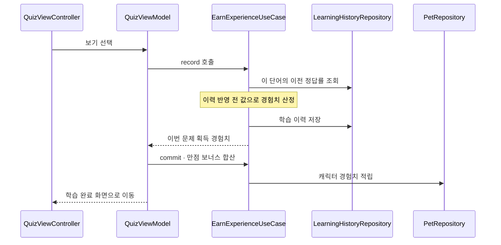
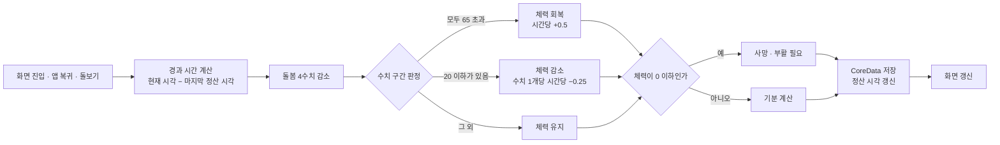

# 단어고치

> 단어고치는 영어학습을 하고 사용자의 성장을 캐릭터의 성장으로 표현해<br/>
> 학습의 재미와 성장을 직관적으로 보여주는 앱 입니다

**핵심 개발**: 2025.09 ~ 2025.10<br>
**유지보수**: 2025.10 ~ 현재<br>
**개발 인원**: 1인 개발<br>
**최소 지원 버전**: iOS 17.0<br>

[](https://apps.apple.com/kr/app/%EB%8B%A8%EC%96%B4%EA%B3%A0%EC%B9%98/id6753820016)

## 주요 화면

| 관심사 선택 | 배경 테마 선택 | 알 선택 |
|:---:|:---:|:---:|
|  |  |  |


| 단어 탐색 | 4지선다 퀴즈 | 학습 결과 |
|:---:|:---:|:---:|
|  |  |  |


| 추천 단어장 | 단어 추가 | 단어장 상세 |
|:---:|:---:|:---:|
|  |  |  |

<table>
  <thead>
    <tr>
      <th align="center">캐릭터 화면</th>
    </tr>
  </thead>
  <tbody>
    <tr>
      <td align="center">
        
      </td>
    </tr>
  </tbody>
</table>

## 주요 기능

### 1. 테마 설정
* Unsplash 사진 검색으로 배경 테마 설정
* 내 사진첩(PhotosPicker)에서 고른 사진을 핀치 줌·드래그로 구도를 맞춰 배경 테마로 저장
  — 사진을 화면보다 작게 줄이거나 밖으로 옮긴 영역은 검은 여백으로 채워 저장
* 온보딩(모달)과 설정(push) 두 진입점에서 같은 화면을 재사용, 진입 후 사진첩 자동 표시
* 지원하지 않는 포맷은 선택 직후 안내하고, 저장 실패 시 선택한 사진을 유지해 바로 재시도

### 2. 단어장

* Core Data 기반 커스텀 단어 CRUD
* 추천 단어장의 단어를 `sourceWordId`로 Core Data에 저장
  — 원본을 복사해 나의 단어장에 넣고, 복사본에 원본 id를 남겨 원본–사본을 연결
* 학습중 단어장 전환 (앱 전체에 항상 1개)

### 3. 단어 탐색

* 쇼츠·릴스 형태의 세로 무한 스크롤
* Core Data 기반 단어별 학습 히스토리를 조회해 학습 횟수와 정답률 표시
*  SwiftUI로 포팅한 단어 카드 UI
* TTS 발음 재생

### 4. 4지선다 퀴즈

* P2C(Power of Two Choices) 알고리즘으로 학습중 단어장에서 출제 단어 선정
* 전수 정렬 없이 O(n) 선정, 매번 다른 문제 구성 유지
* 진행률 표시 및 정답/오답 즉시 피드백

### 5. 학습 결과

* 정답/오답 수와 획득 경험치 요약
* 전 문제 정답 시 보너스 경험치
* 틀린 문제만 다시 풀기 / 이어서 학습하기

### 6. 캐릭터 육성

* 포만감, 갈증, 즐거움, 청결 4수치 돌보기 기능
* 돌봄 수치 기반 기분 9종 표시
* 체력(HP) 관리, 사망 및 부활
* 학습 경험치로 수동 레벨업 (최고 Lv.7)
* 앱 종료 중 흐른 시간을 재실행 시 일괄 정산
* 스프라이트 시트 기반 픽셀 아트 애니메이션

### 7. 날씨 연동 배경

* 현재 위치(CoreLocation)로 OpenWeatherMap 현재 날씨를 조회
* 날씨 상태 코드를 `WeatherType` 7종(뇌우·가랑비·비·눈·안개 등 대기 현상·맑음·구름)으로 환산
* 캐릭터와 같은 스프라이트 시트 방식으로, 날씨에 해당하는 행만 골라 배경을 애니메이션
* 위치 거부·네트워크 실패 시 기본 배경(맑음)을 유지하고 화면을 막지 않음
* 화면 진입과 앱 복귀 때 갱신하며, 진행 중 요청이 있으면 중복 호출하지 않음

### 8. 학습 리포트

* 단어 탐색 화면의 리포트 버튼으로 진입하는 학습 기록 대시보드
* 누적 학습 단어·총 정답률·연속 학습일·최근 7일 학습 여부 요약
* 최근 7일 / 이번 달 / 전체 기간별 분석 (Swift Charts)
  — 학습한 단어 수(막대), 회차별 정답률(최근 완료 10회, 선), 학습 단어 품사(도넛), 주제별 학습 비중, 주제·품사별 오답
* 많이 맞힌 단어 순위 → 전체 단어 목록 → 단어 상세(시트)
* 단어를 삭제하거나 수정해도 기록이 남도록 답변 시점의 단어·뜻·주제·품사를 스냅샷으로 저장
* 앱 복귀·날짜 변경·시간대 변경 시 자동 갱신, 로딩 / 빈 상태 / 오류 + 재시도 상태 제공

---

## 아키텍처

### Clean Architecture + MVVM-C


### 디렉토리

```
Danogotchi/
├── App/           앱 진입점 · AppDIContainer · Coordinator 계층
├── Core/          BaseViewController · CoreDataStack · 네트워크 · AppLogger
├── Shared/
│   ├── Domain/    Entity · Repository 프로토콜 · UseCase · Policy
│   ├── Data/      Repository 구현 7종 · Mapper · CoreData 모델 · 추천 단어 시드
│   └── DesignSystem/  색 · 폰트 · 여백 토큰과 공통 컴포넌트
└── Feature/       Feature 폴더 13개 (View / ViewModel 또는 Reducer / Components / Coordinator)
```

## 핵심 아키텍처 패턴

### Clean Architecture
  - App / Core / Shared / Feature 4계층 분리, 의존 방향은 `Feature → Shared → Core` 단방향이며 Feature 간 화면 연결은 Coordinator에서 수행

### MVVM-C (Input/Output)
- 모든 ViewModel이 `BaseViewModel` 프로토콜의 `transform(input:) -> Output`을 구현해 입력과 출력을 한 함수에 고정

### RxSwift 단방향 바인딩
- Input은 `Observable`, Output은 `Driver`/`Signal`로 노출해 UI 스레드와 에러 처리를 타입으로 강제

### TCA (SwiftUI 화면)
- v2.2.0에서 추가한 SwiftUI 화면(`PhotoThemeFeature` · `StudyReportFeature`)은 TCA `@Reducer` + `@ObservableState`로 구성하고, 기존 UIKit 화면은 MVVM-C(RxSwift)를 유지해 **화면 단위로 점진 도입**
- Coordinator가 `Store`를 만들어 `UIHostingController(rootView:)`로 감싸 기존 네비게이션 흐름에 연결하며, 호스팅 서브클래스 없이 네비게이션 바는 SwiftUI 모디파이어로 처리
- Reducer는 화면을 전환하지 않음 — `onThemeSaved` · `onClose` · `onNavigate(StudyReportDestination)` 클로저로 "무슨 일이 일어났는지"만 올리고 목적지는 Coordinator가 결정. 덕분에 같은 `PhotoThemeFeature`를 온보딩(모달 + 닫기 버튼)과 설정(push)에서 그대로 재사용
- 의존성은 `AppDIContainer.makePhotoThemeFeature` · `makeStudyReportFeature`가 생성자로 주입(UseCase 프로토콜 · async 클로저)해 기존 DI 규칙을 따르고, TCA `@Dependency`는 요청 ID용 `uuid`에만 사용
- Effect 취소를 상태 규칙으로 사용 — `.cancellable(id:cancelInFlight: true)`로 새 사진 선택·기간 변경 시 이전 작업을 취소하고, 요청 ID가 다른 늦은 응답은 버림. 화면을 닫거나 사라질 때도 조회를 취소
- Combine을 반환하는 `SavePhotoThemeUseCase`는 `.publisher` Effect로 연결하고, 저장 중 플래그를 구독 전에 세워 중복 탭에 의한 이중 저장을 차단
- `TestStore`로 액션별 상태 변화와 Effect 결과를 빠짐없이 검증

### Coordinator 패턴 
- 모든 화면 전환을 `Coordinator`가 담당(`AppFlowCoordinator` → `MainCoordinator` / `OnboardingCoordinator` → Feature별 Coordinator), VC 직접 push 금지, VC ↔ Coordinator는 delegate로 통신

### UseCase 레이어
- 비즈니스 규칙을 `AddVocabUseCase`, `StartQuizUseCase`, `CarePetUseCase`, `EarnExperienceUseCase` 등으로 분리하고, 정책은 `PetStatePolicy` · `PetLevelPolicy` · `ExperiencePolicy`에 상수까지 모아 테스트 가능하게 유지
- Repository 접근이 필요한 ViewModel은 UseCase 프로토콜을 경유하며, UI 상태 로직과 상태 없는 Domain Policy에는 형식적인 UseCase를 만들지 않음

### Repository 패턴 + DIP
- `Shared/Domain/Interfaces`의 프로토콜과 `Shared/Data/Repositories`의 구현을 분리해 Domain이 CoreData·네트워크를 모르게 구성

### 의존성 주입
- `AppDIContainer`가 팩토리 메서드로 UseCase·ViewModel을 조립하고 조립은 App 계층에서만 수행. 단일 인스턴스가 필요한 Repository(활성 단어장 신호, 펫 1마리 불변식)는 컨테이너가 `lazy`로 보유

### Router 패턴 
- `UnsplashApiRouter` · `WeatherApiRouter`가 `Endpoint`를 구현하고, `DefaultApiClient`가 URLSession과 async/await로 요청을 실행

### 디자인 시스템 토큰화
- `AppColor` · `AppFont` · `AppSpacing` · `AppRadius` 토큰과 공용 컴포넌트를 `Shared/DesignSystem`에 모아 UIKit·SwiftUI 양쪽에서 공유

### 데이터 플로우 
- View → ViewModel → UseCase → Repository → CoreData 동기 저장 성공 → 변경 신호(Relay) 방출 → 구독 측 재조회. 저장 실패는 롤백 후 화면에 전달하며, 성공한 작업만 UI 갱신과 화면 전환으로 연결

### 테스트: 
- 정책·UseCase·ViewModel·Reducer·영속화·네트워크·이미지 처리 테스트 250개 (`PetStatePolicyTests`, `VocabUseCaseTests`, `PetPersistenceTests` 등)

## 데이터 흐름

### 퀴즈 정답 → 경험치 적립


```mermaid
sequenceDiagram
    participant V as QuizViewController
    participant VM as QuizViewModel
    participant UC as EarnExperienceUseCase
    participant H as LearningHistoryRepository
    participant P as PetRepository

    V->>VM: 보기 선택
    VM->>UC: record 호출
    UC->>H: 이 단어의 이전 정답률 조회
    Note over UC: 이력 반영 전 값으로 경험치 산정
    UC->>H: 학습 이력 저장
    UC-->>VM: 이번 문제 획득 경험치
    VM->>UC: commit · 만점 보너스 합산
    UC->>P: 캐릭터 경험치 적립
    VM-->>V: 학습 완료 화면으로 이동
```

### 캐릭터 상태 정산

화면을 열거나 앱으로 돌아온 순간, 마지막 정산 시각과의 차이를 계산해 한 번에 반영후 저장


```mermaid
flowchart LR
    A[화면 진입 · 앱 복귀 · 돌보기] --> B[경과 시간 계산<br/>현재 시각 − 마지막 정산 시각]
    B --> C[돌봄 4수치 감소]
    C --> D{수치 구간 판정}
    D -- 모두 65 초과 --> E[체력 회복<br/>시간당 +0.5]
    D -- 20 이하가 있음 --> F[체력 감소<br/>수치 1개당 시간당 −0.25]
    D -- 그 외 --> G[체력 유지]
    E --> H{체력이 0 이하인가}
    F --> H
    G --> H
    H -- 예 --> I[사망 · 부활 필요]
    H -- 아니오 --> J[기분 계산]
    I --> K[CoreData 저장<br/>정산 시각 갱신]
    J --> K
    K --> L[화면 갱신]
```

## 주요 기술

### RxSwift / RxCocoa
* ViewModel은 `Input` / `Output` 구조체와 `transform(input:)` 단일 진입점을 갖습니다.
* 외부에는 `Driver` · `Signal`로 노출해 메인 스레드 실행을 보장합니다.

### Swift Concurrency

* 원격 I/O 경로만 `async`/`await`로 씁니다 — `DefaultApiClient`(URLSession) → `DefaultWeatherRepository` · `DefaultSearchThemeRepository` · `DefaultThemeImageRepository` → `FetchCurrentWeatherUseCase` · `SearchThemeUseCase`. `ApiClient`와 `Endpoint`는 `Sendable`입니다.
* Core Data 쓰기 경로는 동기 `throws`를 유지합니다. "저장 성공 이후에만 변경 신호를 방출한다"는 불변식이 동기 저장에 기대고 있어, 바꿀 이유가 없는 곳을 바꾸지 않았습니다.
* 예외는 학습 리포트 읽기 하나입니다. 전체 기록을 집계하는 무거운 조회라 `fetchReportRecords()`를 `async`로 두고 전용 background context의 `perform`에서 실행해 메인 스레드를 막지 않습니다.
* 사진첩 테마 저장은 `SavePhotoThemeUseCase`가 `Deferred { Future { Task { ... } } }`로 async 저장을 Combine으로 감싸 구독 시점에 시작하고, 결과는 메인에서 방출해 TCA `.publisher` Effect가 그대로 받습니다.
* **Rx ↔ async 경계를 한 곳에 고정**했습니다. `DefaultThemeImageRepository.replace`가 `Single.create` 안에서 `Task`를 띄우고, dispose되면 `task.cancel()`로 취소를 전달하며, 오류는 `Result`로 감싸 구독이 끊기지 않게 합니다.
* **델리게이트 → async**: `DeviceLocationProvider`가 `withCheckedThrowingContinuation`으로 `CLLocationManager` 1회 조회를 `async` 함수로 바꿉니다. 이중 resume과 동시 요청을 막고(`LocationError.requestInProgress`), `@MainActor final class` + `nonisolated override init()`으로 DI 조립부는 메인 격리 밖에 둡니다. 델리게이트 채택은 `@preconcurrency`입니다.
* **취소를 기능으로 씁니다.** 테마 검색은 `searchTask`를 새 검색과 `deinit`에서 취소하고 `Task.isCancelled` · `CancellationError`를 걸러 낡은 응답이 화면을 덮지 않게 합니다. 이미지 포맷 폴백 루프는 `Task.checkCancellation()`으로 다음 포맷 시도를 멈추고, 셀 썸네일은 `prepareForReuse`에서 취소합니다.
* 메인 스레드에서 내보내는 작업은 이미지 디코딩 하나입니다 — `Task.detached(priority: .userInitiated)`로 돌리고 결과 적용만 `@MainActor`에서 합니다.
* 현재 Swift 5 언어 모드입니다. 싱글턴 `CoreDataStack.viewContext`가 DI로 흐르는 구조라 strict concurrency를 켜려면 격리 설계가 먼저 필요해, 앱 코드에는 `actor`를 도입하지 않았습니다. 테스트에서는 `actor` 더블(`ControlledSearchRepository` 등)로 응답 순서를 결정적으로 만듭니다.

### Coordinator
* `AppFlowCoordinator` → `MainCoordinator` / `OnboardingCoordinator` → 화면별 Coordinator 계층입니다.
* 온보딩 완료 여부에 따른 첫 화면 분기도 여기서 결정합니다.

### CoreData
* 엔티티 5종(`VocabEntity` · `VocabBookEntity` · `LearningHistoryEntity` · `QuizSessionEntity` · `PetEntity`)을 사용합니다.
* **ModelV2 마이그레이션(v2.2.0)** — 학습 리포트를 위해 퀴즈 회차(`QuizSessionEntity`)와 답변 스냅샷 필드를 추가하고 `id`에 유니크 제약을 걸었습니다.
  * 경량 마이그레이션 전에 `StudyReportMigration.preflight`가 기존 저장소를 읽기 전용으로 열어 중복·누락 ID를 검사합니다. 유니크 제약 위반으로 마이그레이션이 깨지기 전에 멈추고 기존 행은 지우지 않습니다.
  * 마이그레이션 후 `backfillIfNeeded`가 기존 학습 기록에 단어·뜻·주제·품사 스냅샷을 채우고, 완료 버전을 저장소 메타데이터에 기록합니다. 실패하면 롤백하고 메타데이터도 되돌려 다음 실행에서 재시도합니다.
  * 저장소 로드를 `init`의 `fatalError`에서 `prepareStore() throws`로 바꿔 앱 시작 흐름에서 실패를 처리합니다.
* 리포트 조회는 background context에서 `setQueryGenerationFrom(.current)`로 학습 기록과 회차 두 조회를 같은 저장소 시점에 고정합니다.
* 답변 저장은 회차 ID + 문제 번호로 중복을 판정해, 같은 답변의 재시도는 무시하고 내용이 다른 중복은 `StudyReportDataError`로 거부합니다.
* `Mapper`의 `toDomain()`과 필요한 모델의 `apply(_:)`가 엔티티와 도메인 모델을 변환해 도메인 코드가 `NSManagedObject`를 모릅니다.
* 네트워크 DTO는 `toEntity()`로 Domain Model에 변환하며, 읽기 전용 흐름에 사용하지 않는 `toDTO()`는 만들지 않습니다.

### 배경 테마 이미지 — Kingfisher 제거 후 직접 구현

* **Before** — Kingfisher가 다운로드·디코딩·캐싱을 모두 맡았습니다. 원본 해상도를 그대로 받아 디코딩했고, 내려받는 크기·저장 포맷·디코딩 시점을 제어할 지점이 없었습니다.
* **After** — `URLSession`(`ApiClient.data(from:)`) · `ImageIO` · `ImageFileStorage`로 단계를 나눠 직접 구현하고 외부 이미지 라이브러리 의존성을 제거했습니다.

**내려받기 — 크기는 서버에서 맞춥니다**

* Unsplash 이미지 CDN에 `w`·`h`를 `UIScreen.main.nativeBounds` 픽셀로, `fit=crop&crop=center&q=85`로 요청합니다. 기기가 `scaleAspectFill`로 하던 센터 크롭을 서버가 미리 해주므로 전송량과 디코딩 메모리가 같이 줄고 업스케일이 없습니다.
* 포맷은 HEIC → WebP 순으로 시도합니다. CDN은 `fm`을 못 알아들어도 200에 다른 포맷을 주기 때문에 **상태 코드로는 판정할 수 없습니다.** `ImageDecoder.validate(_:)`가 `CGImageSourceGetType`으로 실제 바이트의 타입을 읽고 64px 썸네일까지 뽑아 디코딩 가능함을 확인한 뒤, 저장 확장자를 그 결과에서 가져옵니다.

**저장 — 로컬 파일로 보관합니다**

* `ImageFileStorage`가 `Library/Application Support/ThemeImage/`에 `UUID + 실제 확장자` 이름으로 `.atomic` 쓰기 후 `isExcludedFromBackup`을 세웁니다. URL이 내려가거나 오프라인이어도 배경이 유지됩니다.
* UserDefaults에는 절대 경로가 아니라 **파일명만** 둡니다. 재설치·복원으로 컨테이너 경로가 바뀌어도 파일을 다시 찾습니다.
* 순서가 불변식입니다 — 새 파일을 커밋한 **뒤** `removeAllExcept(fileName:)`로 이전 파일을 정리합니다. 다운로드가 실패해도 기존 배경을 잃지 않고, 중간에 앱이 죽어도 남은 파일은 다음 저장 때 함께 치워집니다.
* 파일이 사라졌으면 `ObserveThemeUseCase`가 저장해둔 원본 URL로 다시 받아 스스로 복구합니다.

**표시 — ImageIO 다운샘플 디코딩**

* `ImageDecoder.decode(fileURL:maxPixelSize:)`가 `CGImageSourceCreateThumbnailAtIndex`로 **화면 높이 픽셀까지만** 디코딩합니다. 전체 비트맵을 메모리에 펼치지 않습니다.
* 디코딩은 `Task.detached(priority: .userInitiated)`에서 끝내고 메인에서는 크로스 디졸브만 합니다. 같은 파일이면 건너뛰고, 새 이미지가 오면 직전 디코딩을 취소합니다.
* 확장자가 아니라 내용으로 포맷을 판별하므로 HEIC·WebP·JPEG 어느 것이 저장돼 있든 같은 경로로 동작합니다.

**테마 검색 그리드**

* 썸네일(`urls.small`)은 `RemoteImageLoader`가 `URLSession` + `NSCache`로 메모리에만 올립니다. 디스크에 쓰지 않고, 셀 재사용 시 `prepareForReuse`에서 요청을 취소하며, 캐시에 있으면 동기로 꺼내 빈 칸이 깜빡이지 않게 합니다.

### 내 사진 테마 — PhotosUI + 크롭 합성 직접 구현

**불러오기 — 선택 직후 다운샘플**

* `PhotosPicker`의 `loadTransferable(type: Data.self)`로 원본 바이트를 받습니다. iCloud 원본이면 다운로드가 일어나므로 로딩 상태를 두고, 새 사진을 고르면 이전 로딩을 취소합니다.
* 미리보기는 `ImageDecoder.decode(data:maxPixelSize:)`로 메모리에서 바로 화면 높이 픽셀까지만 다운샘플합니다. `UIImage(data:)`처럼 48MP 원본을 그대로 펼치지 않습니다.
* ImageIO가 디코딩하지 못하는 포맷은 "지정" 버튼이 아니라 선택 직후에 걸러 안내합니다.

**구도 조절 — UIScrollView 기반 크롭 뷰**

* SwiftUI 제스처 대신 `UIViewRepresentable`로 감싼 `PhotoCropScrollView`(UIScrollView 줌·스크롤)를 씁니다. 처음에는 화면을 꽉 채우는 배율로 가운데를 보여주고, 화면보다 작게 줄이거나 사진 전체가 화면 밖으로 나갈 만큼 옮길 수 있습니다.
* 보이는 영역을 원본 기준 **0...1 정규화 좌표**(`PhotoThemeCrop`)로 보고합니다. 0...1 밖은 검은 여백이고, 유한하지 않거나 원본과 겹치지 않는 영역은 타입 생성 자체가 실패해 화면과 저장이 같은 규칙을 공유합니다.
* 회전·리사이즈 때 선택 중심과 상대 배율을 유지하고, VoiceOver에서는 확대·축소·상하좌우 이동 커스텀 액션을 제공합니다.

**저장 — 화면 규격으로 합성**

* `ThemeImageRenderer`가 선택 영역에 필요한 만큼만 다운샘플한 뒤, `UIGraphicsImageRenderer`로 화면 픽셀 크기의 불투명 캔버스에 검은 여백과 함께 합성합니다. EXIF 방향은 디코딩 단계에서 한 번만 적용합니다.
* 원본 픽셀이 화면보다 모자라면 여백과 사진의 비율을 유지한 채 캔버스 전체를 줄여 **업스케일하지 않습니다.**
* 인코딩은 HEIC → JPEG 순으로 시도하고, 저장은 Unsplash 테마와 같은 `ImageFileStorage` 경로(새 파일 커밋 → 이전 파일 정리)를 탑니다.
* 사진첩 사진은 다시 받을 원본 URL이 없어 `currentThemeUrl`을 비워 재다운로드 복구 대상에서 제외합니다. 온보딩 완료 판별도 URL이 아니라 `hasSelectedTheme`(파일명 또는 URL 존재)으로 바꿨습니다.

### 학습 리포트 — Swift Charts + 스냅샷 집계

* 퀴즈를 시작할 때 `QuizSession`(회차 ID · 문제 수)을 만들고, 답변마다 회차 ID와 문제 번호, 그 시점의 단어·뜻·주제·품사 스냅샷을 함께 저장합니다. 원본 단어가 삭제·수정돼도 리포트가 변하지 않습니다.
* 같은 추천 단어를 여러 번 담아도 하나로 세도록 `sourceWordId`가 있으면 그것을, 없으면 단어 ID를 집계 키로 씁니다.
* `FetchStudyReportUseCase.aggregate`는 `now`·`Calendar`를 받는 순수 함수로, 기간별 필터·연속 학습일·일/월 단위 활동량·주제/품사별 오답을 계산합니다. 모든 문제를 푼 회차만 회차별 정답률에 포함합니다.
* 차트는 Swift Charts의 `BarMark` · `LineMark` + `PointMark` · `SectorMark`로 그리고, `chartXSelection` · `chartAngleSelection`으로 막대·점·조각을 선택합니다. 각 마크에 접근성 라벨·값을 달고 Dynamic Type 접근성 크기에서는 가로 배치를 세로로 바꿉니다.
* 화면 전환(단어 목록 push, 단어 상세 `.pageSheet` medium/large)은 Reducer가 아니라 `MainCoordinator`가 담당합니다.

### DiffableDataSource
* 단어 카드·단어장·테마 목록에 사용합니다.
* 테마 검색 화면은 높이가 제각각인 사진을 위해 워터폴 레이아웃(`WaterFallLayout`)을 직접 구현했습니다.

### SwiftUI 부분 도입
* 단어 카드의 블러 레이어를 SwiftUI로 구현.
* v2.2.0의 사진 테마·학습 리포트 화면은 SwiftUI + TCA로 화면 전체를 구현.
* `UIHostingController`로 UIKit 네비게이션에 SwiftUI 화면을 연결.

### 디자인 시스템
* 색·폰트·여백·모서리 반경을 토큰(`AppColor` · `AppFont` · `AppSpacing` · `AppRadius` · `AppBorder`)으로 고정했습니다.
* 화면 코드에 색상값과 폰트 크기를 직접 쓰지 않습니다.

### OSLog
* `AppLogger` 5개 카테고리로 분류합니다.
* subsystem이 번들 ID라 개발용과 운영용 로그가 Console에서 자동으로 분리됩니다.

### XCTest
* 정책·UseCase·ViewModel·Reducer·영속화·네트워크·이미지 처리 테스트 **250개**를 운영합니다.
* 사진 테마 온보딩·학습 리포트는 XCUITest **8개**로 실제 화면 흐름을 검증합니다. 실행 인자(`-uiTestingReset`)로 첫 설치 상태를 만들고, 환경 변수로 고정된 리포트 시나리오를 주입합니다.

### 빌드 설정
* `xcconfig`로 개발용·운영용 스킴을 분리했습니다.
* 번들 ID, 앱 이름, 스킴에 따라 자동으로 바뀝니다.

### 테스트

#### 테스트 가능한 구조 설계

- Repository·UseCase·`ApiClient`·`LocationProviding`을 **프로토콜로 추상화**하고 **생성자 주입**으로 연결해, 테스트에서 Controlled·Recording 더블로 대체합니다.
- 비즈니스 규칙을 `PetStatePolicy`·`StudyReminderPolicy` 등 정책과 UseCase로 분리해 **UI 없이 로직만 단독으로 검증**합니다. ViewModel은 `transform(input:)`의 Output을, 학습 리포트 Reducer는 TCA `TestStore`로 상태 변화를 검증합니다.
- 시간·랜덤 값은 **매개변수로 주입**합니다.
  - 정책과 리포트 집계는 `now`·`Calendar`를 받아 테스트에서 시각과 타임존을 고정합니다.
  - 퀴즈 출제(`selectByTournament`)는 `RandomNumberGenerator`를 받습니다.
- 외부 자원은 테스트용 구현으로 교체합니다.
  - 네트워크: `URLProtocol` 스텁
  - Core Data: 인메모리 저장소, 저장 실패를 일으키는 `FailingSaveContext`
  - 파일: 임시 디렉터리 `FileManager`

#### 테스트 적용 범위

- 모든 코드를 테스트하기보다, **로직이 복잡하거나 사이드 이펙트의 영향 범위가 큰 부분**에 유닛 테스트를 집중했습니다.
  - 상태 전이: 펫 체력 감소·돌보기·사망·부활, 레벨·경험치 정책
  - 데이터 계산: 퀴즈 출제·채점, 학습 리포트 기간별 집계·연속 학습일, 학습 알림 일정
  - 이미지 처리: 크롭 영역 좌표 변환, EXIF 방향 8종, 검은 여백 합성, 업스케일 방지
  - 저장·동기화: 저장 실패 시 롤백·재시도, SQLite 재개방, Core Data 마이그레이션·백필 실패 후 재시도, 테마 이미지 교체 실패 시 기존 파일 보존
  - 비동기 흐름: 검색 응답 순서 보장·이전 요청 취소·페이지 재시도
- 단순한 UI 코드나 변경 영향이 작은 코드는 테스트 비용 대비 효과를 고려해 제외했습니다.

#### 테스트 원칙

- **일관성 있는 결과**: 시각·타임존을 고정한 입력으로 같은 결과를 보장하고, 비동기 응답 순서는 `actor` 더블로 직접 제어합니다.
- **독립성**: 테스트마다 새 인메모리 저장소와 임시 디렉터리를 만들어 실행 순서에 영향받지 않게 했습니다.
- **사이드 이펙트 격리**: 경험치 적립·알림 예약·테마 저장 같은 외부 상태 변경은 Recording·Controlled 더블로 대체해, 호출 여부와 전달된 값을 검증합니다.

#### 테스트 환경

- 프레임워크: XCTest, TCA `TestStore`
- 테스트 대상: Policy, UseCase, ViewModel, Reducer, Repository, ApiClient, 이미지 디코딩·렌더링
